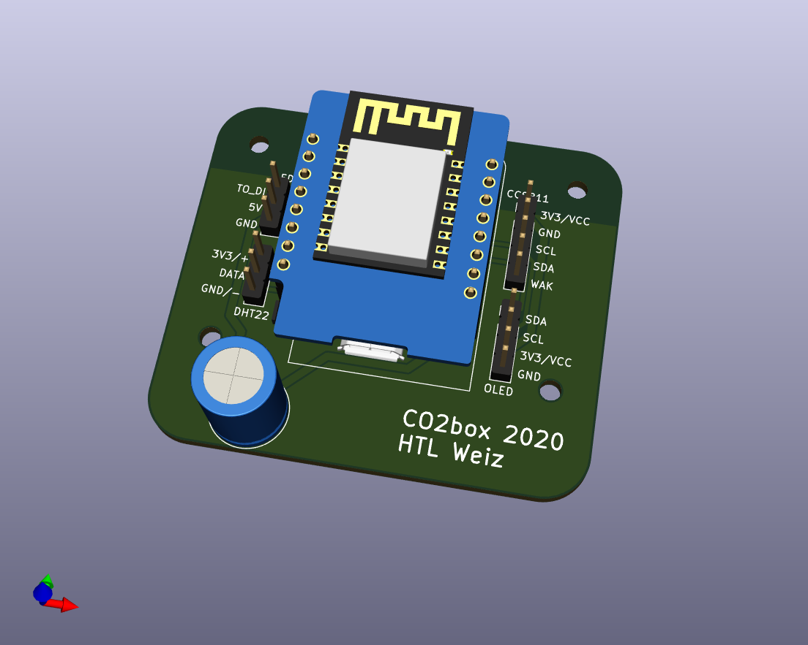

# eCO2 measurement box
A small-ish and simple box to measure
- eCO2 with a CCS811
- Temperature and Humidity with a DHT22

using a Wemos D1 mini (or clone) with visualization on a
- 0.96" I2C OLED
- NeoPixel compatible RGB LED ring (WS2812B)

The thresholds are set according to [REHVA's recommendations for schools](https://www.rehva.eu/fileadmin/user_upload/REHVA_COVID-19_guidance_document_School_guidance_25112020.pdf).

## Burn-In
For full sensor accuracy, according to the [datasheet](https://www.sciosense.com/wp-content/uploads/2020/01/CCS811-Datasheet.pdf), the device first needs a "burn-in" phase of 48 operating hours. 

## Run-In
After the "burn-in" phase, the values are considered accurate after a "run-in" time of 20 minutes after power on. Make sure you expose the sensor to clean air throughout the run-in or shortly afterwards to correctly set the baseline (low CO2) for correct sensor readings.

## Flashing
- Install the newest [ESP8266 support](https://www.heise.de/ct/artikel/Arduino-IDE-installieren-und-fit-machen-fuer-ESP8266-und-ESP32-4130814.html)
- Add the following libraries (using the built-in library manager, *Tools –> Manage Libraries...*)
  - NeoPixelBus by Makuna (LGPL-3.0 License)
  - Adafruit CCS811 (MIT License)
  - DHT sensor library by Adafruit (MIT License)
  - Adafruit SSD1306 (BSD License)

## PCB
The PCB has been designed with KiCad and uses the corresponding [libraries](https://kicad.org/libraries/) which are available under the [Creative Commons CC-BY-SA 4.0 License](https://creativecommons.org/licenses/by-sa/4.0/legalcode). Additionally, a [footprint](https://github.com/rubienr/wemos-d1-mini-kicad) made by [rubienr](https://github.com/rubienr) is used.

The PCB is designed to be screwed into a case available at [aliexpress](https://de.aliexpress.com/item/4000068796385.html?spm=a2g0s.9042311.0.0.52614c4dDeY8Wv).

